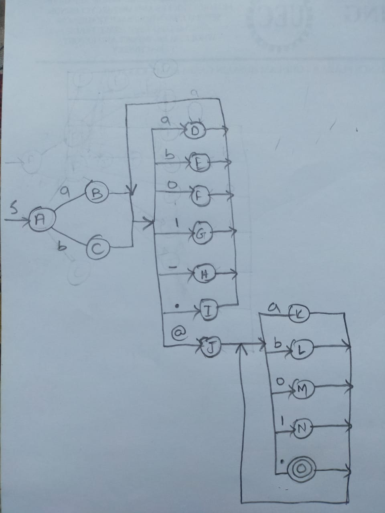

# Compiler Construction 106395 Spring 2021: Class Activity# 1

An activity focused on making a program to accept a language accepted by some RE.

You are given the alphabet set as below. Design an RE for valid email addresses based on this alphabet set. Make an NFA for it, then a DFA and finally a TDI.

Alphabet = { "a", "b", "0", "1", ".", "\_", "@" }

## Rules

-   The email address cannot start with a digit, underscore or period. It should always start with a letter.
-   There can only be a single @ in the email address.
-   Consecutive underscores and periods are allowed.

## Regular Expression

```
( a + b )( a + b + 0 + 1 + . + _ )* @ ( a + b + 0 + 1 + . )*
```

## NFA from Regular Expression


## Transition Table


## DFA from NFA / Transition Table



## Table-Driven Implementation of DFA


## Program Demonstration


